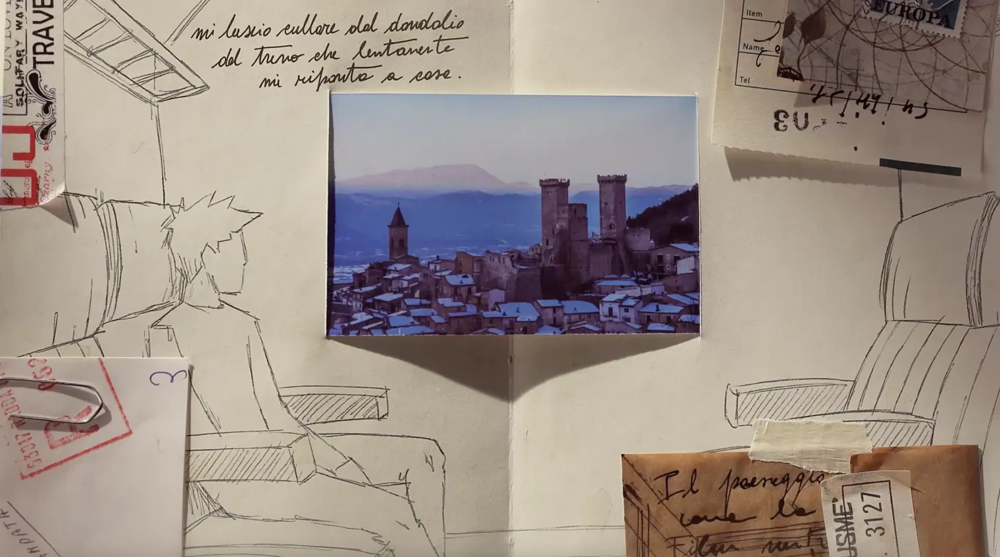

没有画质精良的风光大片，没有过多着墨在关于意大利我们联想到的一切——艺术品、城堡、教堂钟声、废墟、阿尔卑斯山——之上，这支TVC呈现了一个简单淳朴、风光怡人的意大利，以及一趟孤独但温馨、不具备普遍意义的参考价值但每个人都不妨一试的旅行样本。它也打破了我们对旅行宣传片应该恢弘大气、风光尽收的刻板印象，证明小而美、私人而真诚，同样让人心动。

最后，真的得夸一夸其中几句文案，与君共勉：

*我走得很慢，我学习停下，*

*去发现，*

*我最终发现了，*

*旅程本身，比到达更重要。*