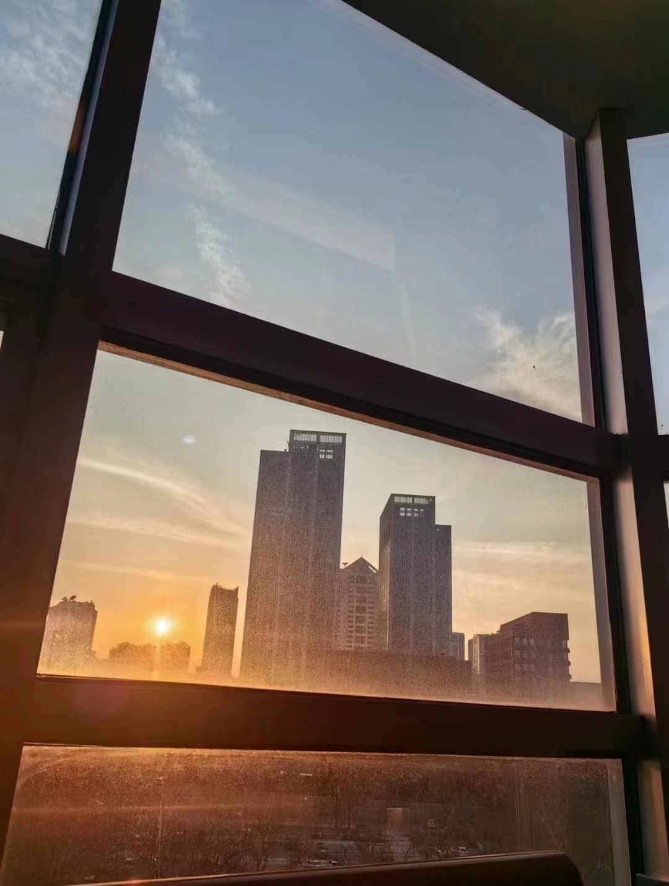

​       落日，那是真正的落日。当我初瞥见它的一丝光芒时，便已为它的壮丽而震颤不已。光穿过天边的薄雾浓云，一寸寸打在我的手心，在身后析出一片七色的光影。云霭缥缈，在已不嚣张的夕晖下，舒卷自如，正如木棉殷红的花丛，浩盛，却不铺天盖地，遍野张扬。金色，温暖，平和，绚烂。霞光晕开在每一个晚归的人群。太阳在挣扎中渐渐下沉，使得我的心境也如此了。直至它嵌入云的边框中，再没了先前的狂放不羁。
​                                                                                                               ------------- 佚名

